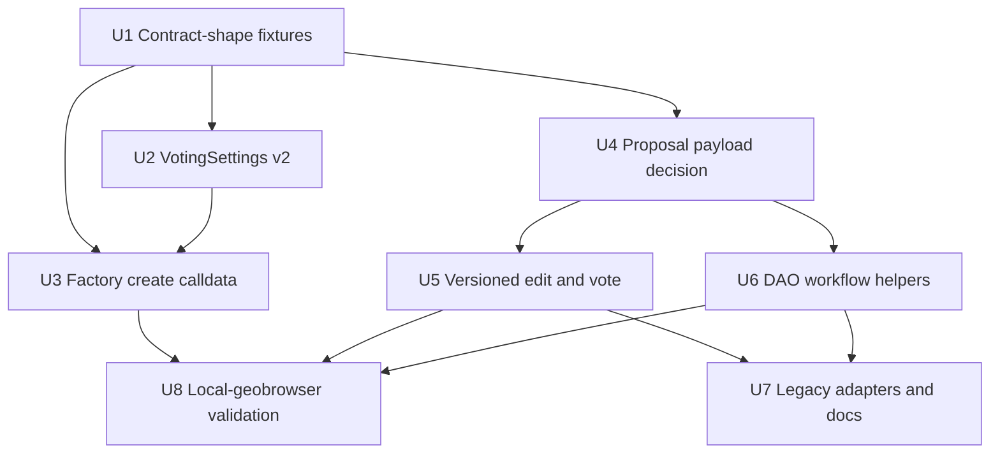

# feat: Upgrade SDK to Contracts V2

## Summary

Plan a breaking Geo SDK upgrade for the contracts v2 DAO-space surface: seven-field voting settings, six-argument DAO factory calldata, version-aware proposal voting/editing, missing DAO proposal helpers, and validation against the `local-geobrowser` checkout named by the user.

**Target repo:** this SDK repo. **Secondary validation repo:** `local-geobrowser`; paths called out under that label are relative to that repo.

---

## Problem Frame

The SDK currently exposes the new client API shape, but key DAO-space encoders still target the older contract layout. The next release needs to deliberately move the SDK onto contracts v2 instead of preserving v1 calldata compatibility, while proving the output works against the local v2 contract checkout before testnet deployment catches up.

---

## Requirements

- R1. Update all SDK `VotingSettingsInput` and contract-shaped `VotingSettings` types, mappers, validators, docs, and examples to the contracts v2 seven-field struct.
- R2. Update DAO factory ABI usage so `createDAOSpaceProxy` encodes the six-input v2 function and no longer passes `_initialTopicData`.
- R3. Keep SDK ABI fragments for `DAOSpaceFactory` and `DAOSpace` synchronized with the v2 Solidity/interface shape, including `votingSettings()`, `updateVotingSettings(...)`, `latestProposalVersion(...)`, and proposal information reads.
- R4. Extend vote calldata to encode the v2 vote payload with `proposalId`, `versionId`, and vote option while keeping the public vote option as `'YES' | 'NO' | 'ABSTAIN'`.
- R5. Resolve the proposal-creation payload shape before implementation and support versioned `proposeEdit` according to the confirmed contract behavior.
- R6. Expose the necessary DAO proposal workflows under the canonical new client surface: publish edit, add/remove member, add/remove editor, request membership, update voting settings, vote, and execute.
- R7. Keep deprecated legacy `daoSpace.*` helpers available, but route them through the v2 implementation and mark the v1-shaped fields as removed in the breaking release.
- R8. Validate deterministic inputs before any IPFS upload or other network side effect in DAO creation/proposal workflows.
- R9. Add unit coverage for every new public DAO helper and every changed encoder, including decode-based assertions against the v2 ABI tuple shapes.
- R10. Add local-geobrowser validation that can exercise SDK-generated calldata against the checked-out v2 contracts/local stack without baking machine-specific paths into the SDK.
- R11. Update README/API documentation and add a breaking-release changeset.

---

## Scope Boundaries

- This plan does not deploy contracts to testnet or mainnet.
- This plan does not perform a full `local-geobrowser` web-app migration; it uses that checkout as the contract and local-stack validation target.
- This plan does not preserve old v1 `slowPathPercentageThreshold` or `fastPathFlatThreshold` field names as accepted aliases in the v2 public SDK surface.
- This plan does not change non-DAO graph, comment, image, entity-vote, or personal-space APIs except where docs need examples to remain coherent.
- This plan does not introduce `GeoMainnetConfig`; current work remains testnet/custom-config focused until a real mainnet config exists.

### Deferred to Follow-Up Work

- Full geobrowser app migration to the v2 SDK helpers: separate consumer-repo work after the SDK contract surface is stable.
- Testnet manual DAO-space creation using the deployed v2 factory: follow-up once the new factory is deployed and addresses are available.
- Gaia protocol documentation cleanup: the local docs currently contain stale v1 payload descriptions; updating those docs belongs in the gaia/local-geobrowser workstream unless the SDK change needs a local fixture.

---

## Context & Research

### Relevant Code and Patterns

- `src/encodings/get-create-dao-space-calldata.ts` owns `VotingSettingsInput`, `VotingSettings`, `percentageToRatio`, `daysToSeconds`, `toContractVotingSettings`, `validateVotingSettingsInput`, and the current v1 `createDAOSpaceProxy` calldata.
- `src/abis/dao-space-factory.ts` still contains the four-field `VotingSettings` tuple and seven-argument `createDAOSpaceProxy` ABI.
- `src/abis/dao-space.ts` still contains older `VotingSettings` and `ProposalParameters` tuple fragments even though it already includes `latestProposalVersion(...)`.
- `src/client/dao-spaces.ts` owns the new client DAO workflows, shared proposal encoding, action builders, and upload-before-calldata ordering.
- `src/client/dao-spaces.test.ts` already decodes `SpaceRegistry.enter(...)` calldata and is the right pattern for v2 tuple assertions.
- `src/dao-space/*` contains deprecated legacy wrappers that already delegate into `createGeoClient(...)`; those wrappers should remain adapters, not separate encoders.
- `src/e2e-flows.test.ts` and `src/full-flow-test.test.ts` are testnet-style end-to-end references, but v2 local validation should be separate and opt-in.
- `README.md` has new API examples and a Legacy API section; both need contract v2 examples.
- `package.json` already exposes `.` / `./client` / `./ops` / `./networks`, and the public import guidance should keep lightweight imports intact.

### local-geobrowser Findings

- `contracts/src/interfaces/IDAOSpace.sol` defines the v2 seven-field `VotingSettings`, eight-field `ProposalParameters`, `latestProposalVersion(...)`, and versioned proposal reads.
- `contracts/src/interfaces/IDAOSpaceFactory.sol` defines the six-argument `createDAOSpaceProxy(...)` and confirms `_initialTopicData` is gone while `_initialTopicId` remains.
- `contracts/src/contracts/DAOSpace.sol` decodes vote data as `proposalId`, `proposalVersion`, `voteOption`, so the SDK vote encoder must emit the three-field payload.
- `contracts/src/contracts/DAOSpace.sol` currently decodes proposal creation/update as `proposalId`, `votingMode`, `actions`, then snapshots `ProposalParameters` internally. This conflicts with the input saying helpers should encode full `ProposalParameters`.
- `governance-app/src/lib/abis.ts` has useful v2 ABI fragments for seven-field voting settings and six-argument factory creation.
- `governance-app/src/lib/votingSettings.ts` has a local form-to-contract mapper for the seven-field struct, but its local defaults are tuned for a local demo rather than SDK public defaults.
- `gaia/docs/protocol/data-encoding.md` and `gaia/docs/protocol/actions.md` still document older proposal/vote payloads and should not be treated as SDK source of truth without confirmation.
- `justfile` provides local stack bring-up and contract deployment tasks that can back an opt-in SDK e2e flow.

### Institutional Learnings

- No `docs/solutions/` learnings exist in this repo.

### External References

- No external web research was used. The plan is grounded in the SDK source and the user-provided local contract checkout.

---

## Key Technical Decisions

- **Solidity/source ABI beats ticket text when they disagree:** before changing proposal creation to full `ProposalParameters`, confirm the target contracts v2 commit. The checked-out contract currently snapshots parameters internally from voting settings, which is safer than SDK-supplied timestamps.
- **Break old voting-settings field names:** this is a breaking contracts v2 release, so SDK types should use `partialPercentageSupportThreshold`, `universalPercentageSupportThreshold`, `flatSupportThreshold`, `quorum`, `durationInDays`, `disableFastPathAccessForNewMembers`, and `executionGracePeriodInDays` on the user-friendly side.
- **Keep user-friendly inputs separate from contract shapes:** public inputs use percentages and days; contract objects use ratio-base values and seconds.
- **Use conservative defaults only where helpers already have defaults:** the SDK should not silently default required DAO creation settings, but any new default helper should use `disableFastPathAccessForNewMembers: true` and an execution grace period of 14 days unless product explicitly changes it.
- **Resolve version IDs before side effects where possible:** `proposeEdit` is async and can resolve the next version before upload when RPC context is available; if the caller supplies an explicit version, validate it before upload.
- **Do not overload `proposalId` ambiguously:** if the final API needs both custom first-version IDs and updates to existing proposals, the parameter set should make the creation/update intent explicit or resolve it by reading `latestProposalVersion(...)`.
- **Keep one public client surface:** add v2 workflow helpers directly to `geo.daoSpaces`; avoid expanding duplicate `geo.daoSpaces.proposals` surface unless a low-level action builder remains intentionally public.
- **Local-geobrowser validation is opt-in:** SDK tests should be deterministic by default, with local-stack e2e gated by environment/config so normal unit tests do not require Docker, Anvil, IPFS, or the sibling checkout.

---

## Open Questions

### Resolved During Planning

- **Should the SDK preserve v1 voting-settings aliases?** No. This is explicitly the breaking contracts v2 release.
- **Should `_initialTopicId` also be removed from DAO factory calldata?** No. The v2 factory interface removes only `_initialTopicData`; `_initialTopicId` remains.
- **Should vote option values change?** No. The v2 Solidity enum is `None=0`, `Yes=1`, `No=2`, `Abstain=3`, matching the SDK constants and `governance-app/src/lib/abis.ts`.

### Deferred to Implementation

- **Does the final contracts v2 proposal creation payload include `ProposalParameters` or only `VotingMode`?** The checked-out contract currently uses `VotingMode`; the input says full `ProposalParameters`. Confirm against the target contract commit before implementing U4.
- **What should `defaultProposalParameters()` mean if timestamps are caller-supplied?** If contracts require full parameters, implementation must decide whether defaults are "relative to call time" or require caller-supplied dates to avoid stale calldata.
- **Should sync role proposal helpers support updating an existing proposal version?** `proposeEdit` needs it; role helpers can remain first-version create-only unless the confirmed contract/API needs arbitrary proposal updates.

---

## High-Level Technical Design

> *This illustrates the intended approach and is directional guidance for review, not implementation specification. The implementing agent should treat it as context, not code to reproduce.*

The work should first establish a contract-shape fixture and shared tuple components, then update SDK encoders and helpers against that contract shape. Local e2e comes last so failures point at contract/API compatibility rather than mixed refactor churn.

---

## Implementation Units

### U1. Contract V2 Source of Truth

**Goal:** Establish a single SDK-local representation of the contracts v2 ABI shapes used by DAO-space helpers.

**Requirements:** R1, R2, R3, R5, R9, R10

**Dependencies:** None

**Files:**
- Modify: `src/abis/dao-space-factory.ts`
- Modify: `src/abis/dao-space.ts`
- Modify: `src/abis/index.ts`
- Test: `src/abis/dao-space-v2.test.ts`
- Reference only: in `local-geobrowser`, `contracts/src/interfaces/IDAOSpace.sol`
- Reference only: in `local-geobrowser`, `contracts/src/interfaces/IDAOSpaceFactory.sol`
- Reference only: in `local-geobrowser`, `governance-app/src/lib/abis.ts`

**Approach:**
- Replace duplicated tuple fragments with shared v2 component constants or a clearly documented local pattern.
- Update factory ABI to seven-field `VotingSettings` and six factory inputs.
- Update DAO ABI fragments for `updateVotingSettings(...)`, `votingSettings()`, proposal information reads, `latestProposalVersion(...)`, and minimum constants used by validation or e2e tests.
- Add an ABI-shape test that asserts tuple field names/order and factory input count. This catches accidental reintroduction of v1 fields without needing a live chain.
- Record the proposal-creation payload conflict in the test fixture or test name so U4 resolves it explicitly.

**Execution note:** Start with ABI-shape tests before modifying downstream encoders.

**Patterns to follow:**
- Existing ABI exports in `src/abis/index.ts`
- Decode-style tests in `src/client/dao-spaces.test.ts`

**Test scenarios:**
- Happy path: DAO factory ABI exposes `createDAOSpaceProxy` with exactly six inputs and the v2 voting-settings tuple.
- Happy path: DAO ABI exposes `updateVotingSettings(...)` and `votingSettings()` with seven fields in Solidity order.
- Happy path: DAO ABI exposes version-aware reads used by SDK validation/e2e, including `latestProposalVersion(...)`.
- Edge case: no stale tuple component named `slowPathPercentageThreshold` or `fastPathFlatThreshold` remains in DAO-space v2 ABI fragments.

**Verification:**
- SDK ABI tests prove the static contract fragments match the v2 interface files used by local-geobrowser validation.

---

### U2. VotingSettings V2 Types, Mapping, and Validation

**Goal:** Move all SDK voting-settings inputs and contract mappers to the seven-field contracts v2 shape.

**Requirements:** R1, R8, R9, R11

**Dependencies:** U1

**Files:**
- Modify: `src/encodings/get-create-dao-space-calldata.ts`
- Modify: `src/encodings/get-create-dao-space-calldata.test.ts`
- Modify: `src/client.ts`
- Modify: `src/client/dao-spaces.ts`
- Modify: `src/dao-space/types.ts`
- Modify: `README.md`
- Test: `src/encodings/get-create-dao-space-calldata.test.ts`
- Reference only: in `local-geobrowser`, `governance-app/src/lib/votingSettings.ts`

**Approach:**
- Rename public input fields to `partialPercentageSupportThreshold` and `flatSupportThreshold`.
- Add `universalPercentageSupportThreshold`, `disableFastPathAccessForNewMembers`, and `executionGracePeriodInDays`.
- Map input percentages through `percentageToRatio(...)` and input days through `daysToSeconds(...)`; contract output uses `duration` and `executionGracePeriod` seconds.
- Validate both percentage thresholds are between 0 and 100, flat/quorum do not exceed total initial editors, duration is above the SDK minimum, and execution grace period is above the contract minimum used by the target v2 contracts.
- Remove v1 names from new public types. Deprecated legacy wrappers may keep deprecation text, but should compile against the v2 type.

**Execution note:** Characterize current validation errors first, then replace them with v2-specific assertions.

**Patterns to follow:**
- Existing mapper tests in `src/encodings/get-create-dao-space-calldata.test.ts`
- Current docstring examples in `src/client.ts`

**Test scenarios:**
- Happy path: user-friendly settings with partial/universal percentages and duration/grace days map to the expected ratio-base and seconds fields.
- Happy path: `disableFastPathAccessForNewMembers` passes through unchanged.
- Edge case: decimal percentages round/floor according to the existing `percentageToRatio(...)` convention.
- Error path: partial threshold below 0 or above 100 returns a targeted validation error.
- Error path: universal threshold below 0 or above 100 returns a targeted validation error.
- Error path: flat support threshold greater than initial editor count is rejected.
- Error path: quorum greater than initial editor count is rejected.
- Error path: duration below minimum is rejected.
- Error path: execution grace period below minimum is rejected.

**Verification:**
- All TypeScript exports that mention `VotingSettingsInput` use the v2 field names and compile without v1 aliases.

---

### U3. DAO Factory Create Calldata V2

**Goal:** Make DAO-space creation encode the v2 factory call and preserve initial edit/topic behavior.

**Requirements:** R2, R3, R8, R9, R10

**Dependencies:** U1, U2

**Files:**
- Modify: `src/encodings/get-create-dao-space-calldata.ts`
- Modify: `src/client/dao-spaces.ts`
- Modify: `src/dao-space/create-space.ts`
- Modify: `src/client/spaces.test.ts`
- Test: `src/encodings/get-create-dao-space-calldata.test.ts`
- Test: `src/client/dao-spaces.test.ts`
- Reference only: in `local-geobrowser`, `contracts/src/interfaces/IDAOSpaceFactory.sol`
- Reference only: in `local-geobrowser`, `governance-app/src/components/DAOSetupPanel.tsx`

**Approach:**
- Keep `_initialTopicId` support and remove only the trailing `_initialTopicData`.
- Preserve the fixed bug from earlier review: pass initial edit content URI and metadata as the two raw bytes arguments expected by the factory, not a nested ABI blob.
- Ensure `geo.daoSpaces.create(...)` validates voting settings and required contract addresses before publishing the initial edit.
- Make deprecated `daoSpace.createSpace(...)` route through the same v2 create path, creating a client as needed.

**Patterns to follow:**
- Existing `getCreateDaoSpaceCalldata(...)` validation and IPFS URI checks.
- `governance-app/src/components/DAOSetupPanel.tsx` six-argument factory call in the secondary repo.

**Test scenarios:**
- Happy path: decoded factory calldata has six arguments and v2 voting-settings fields.
- Happy path: no initial edit URI encodes empty bytes for content URI and metadata.
- Happy path: valid initial edit URI encodes into `_initialEditsContentUri` while `_initialEditsMetadata` remains empty.
- Happy path: initial topic ID is still present as the sixth argument.
- Error path: missing initial editors is rejected before calldata encoding.
- Error path: invalid voting settings are rejected before edit upload in `geo.daoSpaces.create(...)`.
- Integration: `geo.daoSpaces.create(...)` validates with a placeholder CID before upload and then re-encodes with the returned CID.

**Verification:**
- DAO creation calldata decodes against the v2 factory ABI from U1 and no test expects the removed seventh argument.

---

### U4. Proposal Payload and Parameters Decision

**Goal:** Resolve and implement the proposal creation/update payload shape without guessing around the contract mismatch.

**Requirements:** R5, R6, R8, R9, R10

**Dependencies:** U1

**Files:**
- Modify: `src/client/dao-spaces.ts`
- Modify: `src/dao-space/types.ts`
- Modify: `src/dao-space/propose-edit.ts`
- Modify: `src/dao-space/propose-add-member.ts`
- Modify: `src/dao-space/propose-remove-member.ts`
- Modify: `src/dao-space/propose-add-editor.ts`
- Modify: `src/dao-space/propose-remove-editor.ts`
- Test: `src/client/dao-spaces.test.ts`
- Test: `src/dao-space/propose-edit.test.ts`
- Reference only: in `local-geobrowser`, `contracts/src/contracts/DAOSpace.sol`
- Reference only: in `local-geobrowser`, `governance-app/src/components/CreateProposalModal.tsx`
- Reference only: in `local-geobrowser`, `governance-app/src/components/UpdateProposalModal.tsx`

**Approach:**
- Confirm whether the final v2 `PROPOSAL_CREATED` and `PROPOSAL_UPDATED` payloads are still `proposalId`, `votingMode`, `actions` or have changed to include full `ProposalParameters`.
- If the checked-out contract remains authoritative, keep SDK proposal creation/update payloads at the current three-field shape and do not expose user-supplied `ProposalParameters` for creation.
- If a newer contract commit requires full `ProposalParameters`, add `ProposalParametersInput`, contract-shaped `ProposalParameters`, validation, and `defaultProposalParameters(...)` in the shared DAO proposal module.
- In either branch, keep validation before upload and keep action encoding reusable across high-level helpers.

**Execution note:** Treat this as a contract-confirmation gate; do not implement full `ProposalParameters` just because the ticket text mentions it if the target contract still derives parameters on-chain.

**Patterns to follow:**
- Current `encodeCreateProposal(...)` in `src/client/dao-spaces.ts`
- Current local-geobrowser proposal forms, which still encode `proposalId`, `VotingMode`, and actions.

**Test scenarios:**
- Happy path: create-proposal payload decodes against the confirmed contract tuple.
- Happy path: update-proposal payload, if supported by the public helper, decodes against the confirmed contract tuple.
- Error path: invalid voting mode is rejected before calldata is returned.
- Error path: full `ProposalParameters`, if implemented, reject stale or internally inconsistent `startDate`, `lastDate`, and `executeBy` values.
- Integration: proposal action arrays keep DAO target address, value, and calldata intact after wrapping in `SpaceRegistry.enter(...)`.

**Verification:**
- The SDK has one confirmed proposal payload encoder and tests fail if the contract tuple shape changes.

---

### U5. Versioned proposeEdit and voteProposal

**Goal:** Add proposal-version support to edit proposals and votes.

**Requirements:** R4, R5, R8, R9, R10

**Dependencies:** U1, U4

**Files:**
- Modify: `src/client/dao-spaces.ts`
- Modify: `src/client.ts`
- Modify: `src/dao-space/propose-edit.ts`
- Modify: `src/dao-space/vote-proposal.ts`
- Modify: `src/dao-space/types.ts`
- Modify: `src/dao-space/constants.ts`
- Test: `src/client/dao-spaces.test.ts`
- Test: `src/dao-space/propose-edit.test.ts`
- Test: `src/dao-space/vote-proposal.test.ts`
- Reference only: in `local-geobrowser`, `contracts/src/contracts/DAOSpace.sol`

**Approach:**
- Add `versionId` to `ProposeEditResult` and include it in the new client return type and deprecated legacy wrapper result.
- For new proposal creation, return version `1` unless contract confirmation proves versions start elsewhere.
- For a supplied existing proposal, resolve next version by reading `latestProposalVersion(...)` when RPC context is available, or require an explicit version/action intent before upload.
- Encode `voteProposal` data with `proposalId`, `versionId`, and mapped vote option.
- Keep vote synchronous unless the API intentionally grows an async "latest vote" helper; default `versionId` to `1` only for first-version convenience and document that updated proposals require the caller to pass the latest version.
- Add `PROPOSAL_UPDATED_ACTION` if `proposeEdit` supports new-version flow against `PROPOSAL_UPDATED`.

**Patterns to follow:**
- Current vote/execute decode tests in `src/client/dao-spaces.test.ts`
- Current `latestProposalVersion(...)` ABI fragment once updated in U1

**Test scenarios:**
- Happy path: `proposeEdit` without `proposalId` returns a generated proposal ID and version `1`.
- Happy path: `proposeEdit` with a known existing proposal resolves the next version before uploading.
- Happy path: explicit version input is validated and returned without an RPC read.
- Happy path: vote calldata decodes as `proposalId`, `versionId`, and vote option.
- Edge case: voting without `versionId` encodes version `1`.
- Error path: invalid version values such as `0`, negative numbers, decimals, or values above `uint8` are rejected.
- Error path: missing RPC context for implicit new-version resolution throws before IPFS upload.
- Integration: versioned proposal updates use `PROPOSAL_UPDATED` when the confirmed contract requires it.

**Verification:**
- Versioned vote calldata matches the v2 Solidity decode shape, and `proposeEdit` cannot upload an edit before knowing which proposal version it will target.

---

### U6. DAO Workflow Helper Coverage

**Goal:** Fill the remaining high-level DAO helper gaps and align existing helpers with the v2 proposal encoder.

**Requirements:** R6, R7, R8, R9

**Dependencies:** U2, U4, U5

**Files:**
- Modify: `src/client/dao-spaces.ts`
- Modify: `src/client.ts`
- Create: `src/dao-space/propose-update-voting-settings.ts`
- Modify: `src/dao-space/index.ts`
- Modify: `src/dao-space/types.ts`
- Modify: `src/dao-space/propose-add-member.ts`
- Modify: `src/dao-space/propose-remove-member.ts`
- Modify: `src/dao-space/propose-add-editor.ts`
- Modify: `src/dao-space/propose-remove-editor.ts`
- Test: `src/client/dao-spaces.test.ts`
- Test: `src/dao-space/propose-update-voting-settings.test.ts`
- Test: `src/dao-space/propose-add-editor.test.ts`
- Test: `src/dao-space/propose-remove-editor.test.ts`
- Test: `src/dao-space/propose-add-member.test.ts`
- Test: `src/dao-space/propose-remove-member.test.ts`

**Approach:**
- Expose `geo.daoSpaces.proposeUpdateVotingSettings(...)` and deprecated `daoSpace.proposeUpdateVotingSettings(...)`.
- Encode `updateVotingSettings(VotingSettings)` as a DAO action with the v2 seven-field settings and wrap it in the confirmed proposal payload.
- Keep editor add/remove proposals restricted to slow voting at type and runtime levels.
- Align add/remove member, add/remove editor, request membership, vote, and execute helpers around the same shared ID validation and proposal wrapping.
- Re-evaluate the nested `geo.daoSpaces.proposals` surface during implementation; the v2 release should not add duplicate public entry points if direct `geo.daoSpaces.*` helpers cover the workflow.

**Patterns to follow:**
- Existing role proposal helpers in `src/client/dao-spaces.ts`
- Existing legacy wrappers in `src/dao-space/propose-add-member.ts` and related files

**Test scenarios:**
- Happy path: propose update voting settings decodes to a DAO `updateVotingSettings(...)` action whose tuple matches the input settings.
- Happy path: add/remove member helpers wrap DAO role calldata in the confirmed proposal payload.
- Happy path: add/remove editor helpers wrap DAO role calldata and default to slow voting.
- Error path: editor add/remove reject `FAST`.
- Error path: DAO role helpers no longer require a DAO contract address.
- Error path: invalid author, DAO, target member/editor, or proposal IDs are rejected consistently.
- Integration: deprecated legacy helpers return the same calldata shape as the new client helper for the same inputs.

**Verification:**
- Every high-level DAO proposal helper has equivalent new-client coverage and, where still exported, a deprecated legacy adapter.

---

### U7. Public API, Documentation, and Breaking Release Packaging

**Goal:** Make the v2 breaking API coherent for SDK consumers and release tooling.

**Requirements:** R6, R7, R11

**Dependencies:** U2, U3, U5, U6

**Files:**
- Modify: `README.md`
- Modify: `index.ts`
- Modify: `src/client.ts`
- Modify: `src/dao-space/index.ts`
- Modify: `src/types.ts`
- Modify: `package.json`
- Create: `.changeset/contracts-v2-dao-space.md`
- Test: `src/client.test.ts`

**Approach:**
- Update README examples for `createGeoClient({ network: GeoTestnetConfig })`, custom `defineGeoNetworkConfig(...)`, DAO space creation, proposal edit, vote with version, role proposals, request membership, and update voting settings.
- Move v1/deprecated helper examples under the Legacy API section and mark them as adapters over the v2 implementation.
- Export any new v2 types/helpers needed by users without exposing internal clients or duplicate namespaces.
- Add a major changeset because v1 voting-settings field names and DAO calldata shapes are intentionally removed.
- Keep lightweight import guidance intact: `@geoprotocol/geo-sdk/ops`, `@geoprotocol/geo-sdk/client`, and `@geoprotocol/geo-sdk/networks` remain the tree-shakeable paths.

**Patterns to follow:**
- Existing README new API and Legacy API sections.
- Current `package.json` export map.

**Test scenarios:**
- Happy path: public types exported from the package root compile in `src/client.test.ts` style type checks.
- Happy path: client creation still rejects string networks and requires a full network config.
- Edge case: no removed v1 voting-settings names appear in new API docs except in migration notes.
- Test expectation: docs examples are not executed directly, but they should align with covered helper tests.

**Verification:**
- Public docs describe one canonical v2 DAO workflow surface and clearly call out the breaking migration from v1 fields.

---

### U8. local-geobrowser Contract Validation

**Goal:** Prove SDK-generated v2 calldata against the local contracts/local stack without making normal SDK tests depend on that checkout.

**Requirements:** R3, R4, R5, R10

**Dependencies:** U3, U5, U6

**Files:**
- Create: `src/contracts-v2/local-geobrowser.e2e.test.ts`
- Modify: `README.md`
- Reference only: in `local-geobrowser`, `justfile`
- Reference only: in `local-geobrowser`, `.deployments.json`
- Reference only: in `local-geobrowser`, `contracts/src/contracts/DAOSpace.sol`
- Reference only: in `local-geobrowser`, `contracts/src/interfaces/IDAOSpaceFactory.sol`

**Approach:**
- Add an opt-in Vitest file that reads local deployment details from environment/config supplied by the user rather than hardcoding the sibling checkout path.
- Build a `defineGeoNetworkConfig(...)` custom network from local RPC/API/contract addresses.
- Exercise pure calldata decoding first: DAO factory create, update voting settings proposal action, vote tuple, and any confirmed proposal update tuple.
- When the local stack is available, submit a minimal DAO creation transaction and verify the contract returns/registers a DAO space address.
- Keep the test skipped by default unless the required local-stack env/config is present.

**Patterns to follow:**
- Existing skipped e2e structure in `src/e2e-flows.test.ts`
- Local stack/deployment conventions documented in `local-geobrowser` `justfile`

**Test scenarios:**
- Happy path: custom local network config uses `SPACE_REGISTRY_ADDRESS` and `DAO_SPACE_FACTORY_ADDRESS` from local deployments.
- Happy path: SDK DAO creation calldata simulates or submits successfully against the local v2 factory.
- Happy path: versioned vote calldata is accepted by the local `SpaceRegistry.enter(...)` / DAO write path when a proposal exists.
- Integration: propose update voting settings emits calldata that decodes through local `DAOSpace.updateVotingSettings(...)`.
- Error path: test exits as skipped with a clear message when local deployment config is missing.

**Verification:**
- Local-geobrowser validation can be run by an implementer with the local stack up, while normal SDK build/unit test workflows remain deterministic.

---

## System-Wide Impact

- **Interaction graph:** DAO helper changes touch root exports, `createGeoClient`, deprecated `daoSpace.*` adapters, ABI modules, encoding helpers, README examples, and local-stack validation.
- **Error propagation:** validation errors should happen before uploads and before transaction calldata is returned; RPC/version resolution errors in `proposeEdit` should be explicit and not masked as IPFS failures.
- **State lifecycle risks:** proposal versions introduce a race when two updates target the same proposal; the SDK can validate expected next version but cannot guarantee no concurrent on-chain update before submission.
- **API surface parity:** new `geo.daoSpaces.*` helpers and deprecated `daoSpace.*` wrappers must expose consistent v2 calldata and result fields.
- **Integration coverage:** unit decode tests prove tuple shape; local-geobrowser e2e proves the same calldata survives viem/contract execution against the v2 stack.
- **Unchanged invariants:** Ops generation, edit publishing binary format, personal-space creation, and custom network config patterns remain unchanged outside DAO-specific wiring.

---

## Risks & Dependencies

| Risk | Mitigation |
|------|------------|
| Proposal creation payload conflict between input ticket and checked-out contract | Make U4 a confirmation gate; implement full `ProposalParameters` only if the target contract actually decodes it. |
| SDK-supplied `ProposalParameters` timestamps could become stale before transaction execution | Prefer contract-derived parameters if current source remains authoritative; if caller-supplied params are required, validate and document timestamp risk. |
| Local protocol docs are stale and may mislead implementation | Treat Solidity interfaces/contracts and governance-app ABI as source of truth; list stale docs as follow-up cleanup. |
| `proposeEdit` uploads an edit before discovering a version/contract error | Resolve proposal version and validate calldata shape before upload. |
| Breaking field-name changes surprise consumers | Use a major changeset, README migration notes, and compile-time type failures rather than runtime aliases. |
| Local e2e flakes due Docker/indexer stack state | Keep e2e opt-in and focus first on contract simulation/calldata acceptance; do not make it part of default unit tests. |
| Concurrent proposal updates race with version resolution | Return/accept explicit `versionId` and document that on-chain submission can still revert if another update lands first. |

---

## Alternative Approaches Considered

- **Keep API-only changes and defer all contract v2 work:** rejected for this plan because the user now wants the contracts v2 breaking release and local contract validation.
- **Preserve v1 field aliases for compatibility:** rejected because it weakens the intended breaking release and makes docs/types less clear.
- **Hard-code `local-geobrowser` absolute paths into SDK tests:** rejected because the plan file and SDK tests need to remain portable across machines and CI.
- **Always fetch latest proposal version in vote helpers:** rejected for the sync vote helper; callers should pass `versionId` for non-v1 votes, while a future async convenience can fetch latest if needed.

---

## Success Metrics

- SDK build and unit tests pass with v2 ABI tuple decode coverage.
- No new public DAO-space examples use v1 voting-settings field names.
- `geo.daoSpaces.create(...)` decodes against the v2 six-input factory ABI.
- `geo.daoSpaces.voteProposal(...)` or the canonical v2 vote helper decodes to the three-field v2 vote payload.
- `proposeEdit` returns `versionId` and validates version/action intent before upload.
- Local-geobrowser opt-in validation can run against a local deployment using custom network config.

---

## Phased Delivery

- **Phase 1:** U1-U3 establish contract shapes and DAO creation. This can land before proposal helper expansion.
- **Phase 2:** U4-U6 resolve proposal payload shape and add versioned/high-level proposal workflows.
- **Phase 3:** U7-U8 finish docs, release packaging, and local-geobrowser validation.

---

## Documentation Plan

- Update README new API examples for all v2 DAO workflows.
- Add a compact migration note from v1 settings names to v2 settings names.
- Keep deprecated legacy helpers under the README Legacy API section.
- Document versioned proposal voting, especially the `versionId` default and updated-proposal requirement.
- Document custom local network config for local-geobrowser validation without referencing machine-specific paths.

---

## Operational / Rollout Notes

- This should ship as a breaking release for SDK consumers.
- The release should not be promoted as testnet-ready until the v2 DAO factory is deployed and `GeoTestnetConfig` points at matching contract addresses.
- If local-geobrowser validation passes but testnet deployment lags, keep README examples framed around custom/local config plus testnet where deployed.
