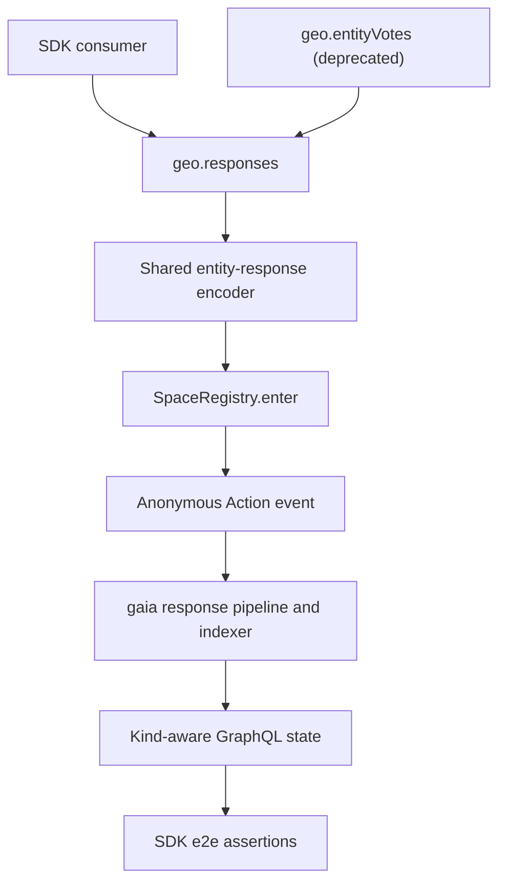
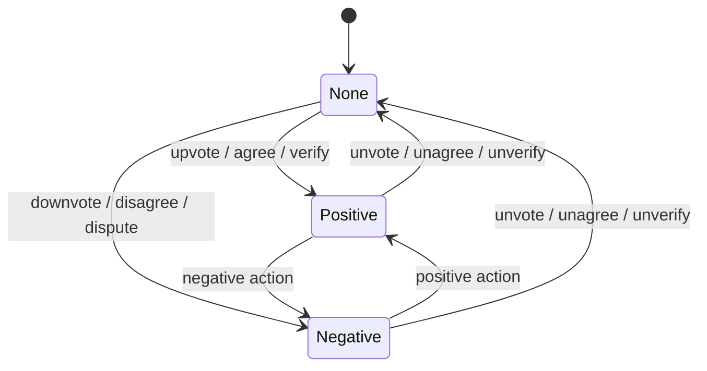

# Entity Response Actions - Plan

## Goal Capsule

- **Objective:** Add curation, stance, and veracity response transactions under the canonical `geo.responses` client namespace while preserving the existing entity-vote API.
- **Authority:** The merged [gaia PR #872](https://github.com/geobrowser/gaia/pull/872) governs response kinds, directions, and clear semantics. The confirmed API and entity-only scope decisions govern the SDK surface. Current SDK conventions govern implementation details. The user-supplied “PRD - New Actions” is supporting context when it does not conflict with the merged PR.
- **Execution profile:** Standard TypeScript feature with public API, compatibility, unit-test, integration-test, documentation, and release-note work.
- **Stop conditions:** Stop and reconcile sources if the deployed action strings or `voteKind` meanings differ from gaia PR #872. Report an external blocker instead of weakening e2e assertions when the target registry lacks the six permissionless registrations or the target API lacks the merged gaia schema.
- **Tail ownership:** SDK implementation includes its changeset and verification. Registry administration, gaia deployment, web-app adoption, and contract-repository documentation remain external.

---

## Product Contract

### Summary

The SDK will expose all entity-response actions through `geo.responses`. The namespace will cover curation (`upvote`, `downvote`, `unvote`), stance (`agree`, `disagree`, `unagree`), and veracity (`verify`, `dispute`, `unverify`). The existing `geo.entityVotes` namespace remains available as a deprecated compatibility adapter for `upvote`, `downvote`, and `withdraw`.

### Problem Frame

gaia can now index three independent response kinds, but the SDK can emit only the original curation actions. Consumers cannot submit Agree, Disagree, Verify, Dispute, or their kind-specific clears through the supported client API. The contract repository also does not define or initialize these actions, so end-to-end proof must distinguish SDK correctness from missing registry administration or backend deployment.

### Requirements

**Canonical response API**

- R1. `createGeoClient(...)` exposes `geo.responses` with nine explicit methods: `upvote`, `downvote`, `unvote`, `agree`, `disagree`, `unagree`, `verify`, `dispute`, and `unverify`.
- R2. Every canonical method accepts the existing entity-target parameters: author space ID, target space ID, and entity ID.
- R3. The three response kinds remain independent because every method maps to its own protocol action while reusing the existing entity topic and data encoding.

**Protocol compatibility**

- R4. Curation calls through `geo.responses` produce byte-for-byte equivalent calldata to the existing `geo.entityVotes` operations.
- R5. All response actions keep object type `0` for entities, encoding version `0`, the current ABI data tuple, and an empty signature.
- R6. Invalid IDs and missing network contract configuration fail before calldata is returned, following current SDK validation behavior.

**Migration compatibility**

- R7. `geo.entityVotes.upvote`, `geo.entityVotes.downvote`, and `geo.entityVotes.withdraw` remain callable and delegate to `geo.responses.upvote`, `geo.responses.downvote`, and `geo.responses.unvote` respectively.
- R8. The SDK marks `geo.entityVotes` and its legacy graph helpers as deprecated in type documentation and user documentation without adding runtime warnings.

**Verification and release**

- R9. Unit coverage pins all nine action strings to their expected hashes and decodes the resulting `SpaceRegistry.enter()` calldata.
- R10. End-to-end coverage submits all six new actions, verifies gaia’s kind and direction state, and proves that clearing one kind does not alter another kind.
- R11. End-to-end setup fails with an actionable dependency error when the registry registrations or gaia schema are unavailable.
- R12. README documentation presents `geo.responses` as canonical, documents the deprecated namespace, and ships a minor changeset.

### Key Decisions

- **One canonical response namespace.** (session-settled: user-directed — chosen over extending `geo.entityVotes`: one namespace keeps curation, stance, and veracity at the same API level.) Governs R1, R4, R7, and R8.
- **Entity targets only.** (session-settled: user-directed — chosen over adding relation-target responses: no current SDK consumer requires relation writes, and adding them would widen the public target model and e2e matrix.) Governs R2 and R5.

### Acceptance Examples

- **AE1. Canonical curation:** Given valid IDs and a configured registry, when a caller invokes `geo.responses.upvote`, then the returned target and calldata match `geo.entityVotes.upvote` for the same inputs. Covers R1, R4, and R7.
- **AE2. Stance transition:** Given an entity with no stance response from the user, when the user agrees, disagrees, and then unagrees, then gaia reports positive stance, negative stance, and no current stance response in sequence. Covers R3, R9, and R10.
- **AE3. Veracity independence:** Given a user who already upvoted an entity, when the user verifies and later unverifies it, then the curation response remains while the veracity response appears and disappears independently. Covers R3 and R10.
- **AE4. Environment not ready:** Given a registry where one of the six new actions is not permissionless, when e2e setup runs, then it identifies the missing action and registry before submitting feature transactions. Covers R11.

### Scope Boundaries

- The SDK produces transaction targets and calldata; it does not submit transactions from `geo.responses`.
- This plan does not add response read APIs. E2e tests use the existing GraphQL client only to verify indexed effects.
- This plan does not change response topic or data encoding, infer response kind from entity data, or inspect whether an entity is a Claim.
- This plan does not change gaia migrations, indexers, GraphQL schema, web controls, analytics, or ranking behavior.
- This plan does not modify `geo-contracts-foundry` or perform registry-owner transactions.

#### Deferred to Follow-Up Work

- Entity-or-relation response targets and a generalized object discriminator.
- Web-app adoption of `geo.responses` and kind-aware reads.
- Contract-repository constants, action documentation, initialization defaults, or deployment scripts for the six new actions.
- Removing `geo.entityVotes` after a separately announced deprecation window.

### Dependencies

- The target gaia deployment must include PR #872 so GraphQL exposes `voteKind` and kind-scoped current state.
- The owner of each target `SpaceRegistry` must enable `PERMISSIONLESS.AGREED`, `DISAGREED`, `UNAGREED`, `VERIFIED`, `DISPUTED`, and `UNVERIFIED` with `setPermissionlessAction`.
- No contract implementation upgrade is required. The current registry already supports owner-managed permissionless action hashes.

### Sources

- [gaia PR #872: vote-kind storage and indexing source of truth](https://github.com/geobrowser/gaia/pull/872)
- [geo-contracts-foundry action constants on `dev`](https://github.com/geobrowser/geo-contracts-foundry/blob/dev/src/ActionsConstants.sol)
- [geo-contracts-foundry `SpaceRegistry` permissionless-action behavior](https://github.com/geobrowser/geo-contracts-foundry/blob/dev/src/contracts/SpaceRegistry.sol)
- User-supplied “PRD - New Actions”, dated 2026-08-04, as supporting product context.

---

## Planning Contract

### Key Technical Decisions

- KTD1. **Use one method per protocol action.** The canonical API maps `upvote`, `downvote`, `unvote`, `agree`, `disagree`, `unagree`, `verify`, `dispute`, and `unverify` one-to-one to the nine action strings from gaia. This avoids a caller-supplied kind/direction combination that can represent invalid pairs.
- KTD2. **Centralize encoding in `responses.ts`.** One internal encoder owns ID normalization, entity topic encoding, response data encoding, `SpaceRegistry.enter()` construction, and the action map. Compatibility layers delegate into it and do not duplicate hashes or ABI logic.
- KTD3. **Keep compatibility compile-time and behavioral.** `geo.entityVotes` remains a typed runtime property with JSDoc deprecation markers. It emits no warning and returns exactly the canonical curation result, matching the repository’s adapter pattern.
- KTD4. **Pin protocol names and bytes independently.** Unit tests derive each action hash from its protocol string and compare it with a fixed expected value from gaia. They also assert pairwise uniqueness so a typo cannot merge response axes.
- KTD5. **Verify current state, not only event acceptance.** E2e tests query kind-filtered `userVotes` and `votesCounts` state after successful transaction receipts. A receipt or raw event alone does not prove the action was registered or that gaia applied kind-scoped overwrite and clear behavior.
- KTD6. **Preflight external readiness without acquiring admin authority.** E2e setup reads `permissionlessActions` for the six new hashes and probes the required GraphQL fields. It reports missing prerequisites rather than impersonating a registry owner or mutating environment configuration.

### High-Level Technical Design

The action map is fixed by gaia’s merged implementation. `voteKind` is the indexed discriminator; the SDK continues to send only the action hash and the existing entity payload.

| SDK method | Protocol action | `voteKind` | Direction | Expected action hash |
|---|---|---:|---|---|
| `upvote` | `PERMISSIONLESS.UPVOTED` | 0 | positive | `0x1fc04a8d9387c7bd1199a2a77c8e531a7a7b11991df5dcc8c9acb6abcb481725` |
| `downvote` | `PERMISSIONLESS.DOWNVOTED` | 0 | negative | `0xde8b897ce7cc541dacb388d5aabb3dc0fb7856920284f41582c15b5fc31a8662` |
| `unvote` | `PERMISSIONLESS.UNVOTED` | 0 | clear | `0x3bd4c337382f79aa5007a91169bb57723b5dd59e6b4bb60d20362bcc0d9d998b` |
| `agree` | `PERMISSIONLESS.AGREED` | 1 | positive | `0xcc1f104e089fb96ad3a3f1e70607f3dda4ed556e810bdc30193f19df474369b9` |
| `disagree` | `PERMISSIONLESS.DISAGREED` | 1 | negative | `0x285c96f1d9b8f9143d333a762cb9fa03e98b3f551a824e99ed14072ca3c51179` |
| `unagree` | `PERMISSIONLESS.UNAGREED` | 1 | clear | `0xa1d2a63f4172ef63617e69ca00a8a5e0e0f886fcd26d742208cc5da02fe32328` |
| `verify` | `PERMISSIONLESS.VERIFIED` | 2 | positive | `0x588446c29505d69d73cba2f34aa402447b77f055539a93aec891beb3fbf3f0fd` |
| `dispute` | `PERMISSIONLESS.DISPUTED` | 2 | negative | `0x839d074bf1854255cda5c35a5c89feb5687db041c8ff22370e8597a58ef7706d` |
| `unverify` | `PERMISSIONLESS.UNVERIFIED` | 2 | clear | `0x9516e48c1d614910098dd6197889f54cb08474c630efdb4cd07bbeee329912c2` |

Each kind follows the same independent state machine. Switching kind never transitions or clears another kind.

### Implementation Sequence

1. Establish the canonical action map, encoder, and exhaustive unit proof.
2. Add the client namespace and route compatibility surfaces through it.
3. Extend the existing API-surface e2e suite once the protocol surface is stable.
4. Update documentation and add the release changeset after names and examples are final.

### Operational Rollout

1. Deploy gaia PR #872 and confirm the target GraphQL API exposes kind-aware current responses and counts.
2. Have the registry owner enable the six new action hashes on each target `SpaceRegistry`.
3. Run U3 against each release environment and require the readiness probe plus all state-transition assertions to pass.
4. Release the SDK only after the target environment passes; consumer adoption can follow independently.

Rolling back the SDK does not require removing the permissionless registrations. gaia already understands the actions, and older SDK clients ignore them. If an incorrect hash was registered, the registry owner should disable that hash, enable the source-of-truth hash, and rerun U3 before release.

### Risks and Mitigations

| Risk | Impact | Mitigation |
|---|---|---|
| Action string or hash drift | Transactions are indexed under no recognized response kind. | Pin all nine fixed hashes and live keccak derivations in one table-driven unit suite. |
| Registry registration missing | A receipt can succeed through the non-permissionless path while producing unusable subject data. | Preflight `permissionlessActions` and assert kind-aware indexed state, not receipt status alone. |
| gaia deployment lag | GraphQL queries fail or omit `voteKind`. | Probe schema readiness and report the API origin and missing field before feature flows. |
| Compatibility logic diverges | Existing consumers produce different curation calldata after upgrading. | Make deprecated methods thin delegates and assert byte-for-byte equality. |
| Cross-kind e2e false positives | An earlier curation event satisfies a stance or veracity predicate. | Use unique entities and include `voteKind` in every query and assertion. |
| “Verified” naming collision | Reviewers confuse response verification with subspace verification. | Use `verify`, `veracity`, or qualified response-action names; avoid bare `verified` identifiers. |

---

## Implementation Units

### U1. Canonical Response Actions and Encoding

- **Goal:** Create the canonical entity-response action map and shared calldata encoder for all nine methods.
- **Requirements:** R1, R2, R3, R5, R6, R9; AE1, AE2, AE3; KTD1, KTD2, KTD4.
- **Dependencies:** None.
- **Files:**
  - Create: `src/client/responses.ts`
  - Create: `src/client/responses.test.ts`
  - Reference: `src/client/entity-votes.ts`
  - Reference: `src/client/entity-votes.test.ts`
- **Approach:**
  1. Define the nine response action strings and derived hashes in the canonical module, grouped by curation, stance, and veracity.
  2. Move the existing ID conversion, entity topic, data tuple, and `enter()` encoding behind one action-parameterized helper.
  3. Expose context-aware operations for the nine canonical method names without accepting arbitrary action hashes. Keep the action-parameterized encoder internal to this module; do not add a new public package subpath or arbitrary-action escape hatch.
  4. Keep entity object type, encoding version, data tuple, and signature unchanged per R5.
- **Patterns to follow:** Mirror `src/client/entity-votes.ts` for `viem` encoding, `assertValid` use, and network address resolution. Mirror the decode-based assertions in `src/client/entity-votes.test.ts`.
- **Test scenarios:**
  1. Each canonical method encodes its exact gaia action hash while every other decoded `enter()` argument stays identical for common inputs.
  2. All nine fixed expected hashes equal a fresh keccak derivation and are pairwise distinct.
  3. Upvote, agree, and verify share the positive direction semantics but retain different action hashes; the same holds for negative and clear groups.
  4. Dashed, raw, and `0x`-prefixed IDs normalize to identical calldata.
  5. Invalid author space, target space, and entity IDs fail before encoding for representative actions from all three kinds.
  6. A context-aware response uses the configured `SPACE_REGISTRY_ADDRESS`; a network without that address fails with the existing contract-configuration error.
- **Verification:** The response test suite decodes every public operation into the expected registry call and fails if any protocol byte or invariant drifts.

### U2. Client Namespace and Deprecated Compatibility

- **Goal:** Make `geo.responses` canonical while preserving the existing client and graph curation APIs as delegates.
- **Requirements:** R1, R4, R6, R7, R8; AE1; KTD2, KTD3.
- **Dependencies:** U1.
- **Files:**
  - Modify: `src/client.ts`
  - Modify: `src/client.test.ts`
  - Modify: `src/client/entity-votes.ts`
  - Modify: `src/client/entity-votes.test.ts`
  - Modify: `src/graph/entity-vote.ts`
  - Modify: `src/graph/entity-vote.test.ts`
- **Approach:**
  1. Add the canonical response parameter type and the nine-method `responses` property to the exported `Client` type and `createGeoClient` result.
  2. Retain `EntityVoteParams` as a deprecated type alias when removal would break imported SDK types.
  3. Keep `entityVotes` on the client, mark it deprecated, and route its three methods to the canonical curation methods.
  4. Preserve the context-free curation encoders as deprecated adapters if their current module exports remain reachable to consumers or internal tests.
  5. Update legacy graph helper deprecation guidance and delegation targets to `geo.responses`.
- **Patterns to follow:** Follow the `createGeoClient` namespace construction in `src/client.ts` and the adapter style in `src/graph/entity-vote.ts`. Deprecation stays in JSDoc and README text, with no console side effect.
- **Test scenarios:**
  1. `Object.keys(geo.responses)` contains exactly the nine canonical methods in documented order.
  2. Each canonical method resolves the configured registry address without requiring `fetch`.
  3. Deprecated upvote and downvote results equal their canonical equivalents byte for byte.
  4. Deprecated `withdraw` equals canonical `unvote` byte for byte.
  5. Existing invalid-ID behavior remains observable through `geo.entityVotes` and legacy graph helpers.
  6. TypeScript compilation accepts old client calls and new calls while surfacing deprecation metadata for the old namespace.
- **Verification:** Existing curation tests remain green, new client-surface assertions pass, and the build emits public declarations for both namespaces.

### U3. Kind-Aware End-to-End Verification

- **Goal:** Prove the canonical SDK methods execute through `SpaceRegistry` and produce gaia’s independent current-state model.
- **Requirements:** R3, R4, R10, R11; AE1, AE2, AE3, AE4; KTD5, KTD6.
- **Dependencies:** U1, U2, and an environment with gaia PR #872 deployed.
- **Files:**
  - Modify: `src/api-surface.e2e.test.ts`
  - Reference: `src/e2e-test-environment.ts`
  - Reference: `src/e2e-wallet.ts`
  - Reference: `src/abis/space-registry.ts`
- **Approach:**
  1. Extend the existing response GraphQL fixtures and wait helpers with `voteKind`, current `userVotes`, and per-kind `votesCounts` fields.
  2. Add an e2e readiness check for the six `permissionlessActions` entries and the merged gaia GraphQL shape.
  3. Exercise canonical curation calls through `geo.responses` while keeping compatibility proof in U2’s deterministic tests.
  4. Use one unique entity for the stance transition and another for the veracity-independence transition so prior runs cannot satisfy predicates.
  5. Reuse transaction receipt checks, indexer alignment checks, and bounded polling already present in the suite.
- **Execution note:** Establish the readiness probe first. A missing external deployment must fail before the suite emits partial response state.
- **Patterns to follow:** Use `sendTransactionAndWait`, `waitFor`, `waitForIndexerBlock`, and the unique-entity helpers in `src/api-surface.e2e.test.ts`.
- **Test scenarios:**
  1. Covers AE1. Canonical upvote is accepted and indexed as kind `0`, positive direction, with the expected curation count.
  2. Covers AE2. Agree creates a kind `1` positive current response; Disagree replaces it with one kind `1` negative response; Unagree removes only the kind `1` current response and returns its counts to zero.
  3. Covers AE3. Upvote followed by Verify leaves both kind `0` and kind `2` current responses; Dispute changes only kind `2`; Unverify removes only kind `2` while curation remains unchanged.
  4. Every successful step is backed by a successful transaction receipt and a kind-filtered indexed-state predicate.
  5. Covers AE4. A missing action registration names the action, network, and registry address without submitting response transactions.
  6. A gaia API without `voteKind`, `positive`, or `negative` fails with an explicit schema-readiness message rather than timing out.
- **Verification:** `pnpm test:e2e` passes against a ready testnet or local-geobrowser environment and proves all six new actions plus curation compatibility.

### U4. Documentation and Release Packaging

- **Goal:** Publish the new canonical API and migration guidance as a minor SDK feature.
- **Requirements:** R8, R12; KTD1, KTD3, KTD6.
- **Dependencies:** U2, U3.
- **Files:**
  - Modify: `README.md`
  - Create: `.changeset/<generated-kebab-name>.md`
- **Approach:**
  1. Replace the main entity-vote section with a `geo.responses` section that explains the three response kinds and all nine method names.
  2. Include one transaction-submission example and concise examples for curation, stance, and veracity.
  3. Move `geo.entityVotes` into compatibility guidance, state that it remains functional, and point each method to its canonical replacement.
  4. Document that new action execution requires gaia deployment and registry-owner registration without presenting SDK consumers as registry administrators.
  5. Add a minor changeset for the new public namespace and actions, noting the non-breaking deprecation.
- **Patterns to follow:** Follow the README’s existing client-namespace sections and the repository changeset format from `AGENTS.md`.
- **Test expectation:** None — this unit changes documentation and release metadata only; U2’s build verifies referenced public names.
- **Verification:** Documentation examples match emitted declarations, the compatibility status is unambiguous, and the changeset targets `@geoprotocol/geo-sdk` with a minor release.

---

## Verification Contract

| Gate | Applies to | Command | Done signal |
|---|---|---|---|
| Focused response tests | U1, U2 | `pnpm test -- src/client/responses.test.ts src/client/entity-votes.test.ts src/client.test.ts src/graph/entity-vote.test.ts` | All protocol, namespace, and compatibility scenarios pass. |
| Full unit suite | U1-U4 | `pnpm test` | No SDK regression outside the response surface. |
| Type and package build | U1, U2, U4 | `pnpm build` | Public declarations contain the canonical and deprecated APIs without TypeScript errors. |
| Repository lint | U1-U4 | `pnpm lint` | Biome reports no errors on code, tests, or documentation it checks. |
| Cross-system e2e | U3 | `pnpm test:e2e` | Transactions succeed and kind-filtered gaia state proves stance, veracity, clear, and independence semantics. |
| Release metadata | U4 | Inspect the new `.changeset/*.md` entry | The package is marked for a minor release with an accurate user-facing summary. |

The e2e gate applies only after its external readiness probe passes. A missing registration or gaia deployment is a reported release blocker, not grounds to skip or weaken the e2e requirement.

---

## Definition of Done

- U1 is complete when all nine canonical operations share one encoder and fixed-hash decode tests cover every protocol action.
- U2 is complete when `geo.responses` is the documented canonical runtime and type surface, while `geo.entityVotes` and graph curation helpers remain compatible deprecated adapters.
- U3 is complete when a ready environment passes the stance transition, veracity independence, curation compatibility, and dependency-failure scenarios.
- U4 is complete when README examples, deprecation guidance, operational prerequisites, and a minor changeset agree with the emitted API.
- All Verification Contract gates pass, except that an external readiness failure must remain explicitly reported until the owning deployment or registry action is completed.
- No relation-target implementation, generic arbitrary-action escape hatch, duplicated encoder, runtime deprecation warning, or unrelated cleanup remains in the diff.
- Experimental or abandoned code from implementation attempts is removed before handoff.
